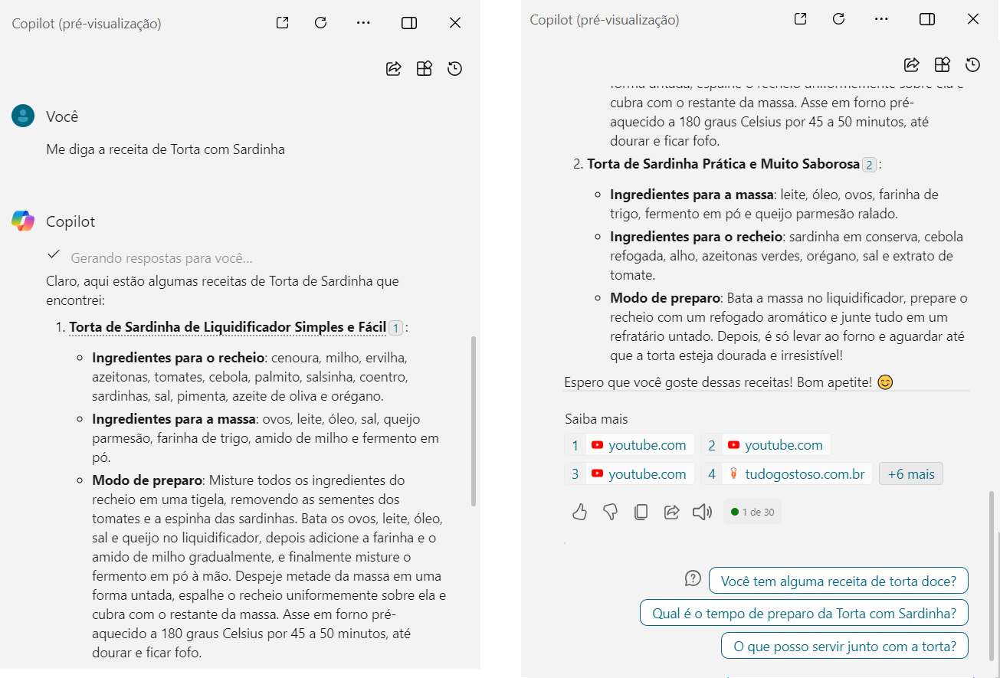
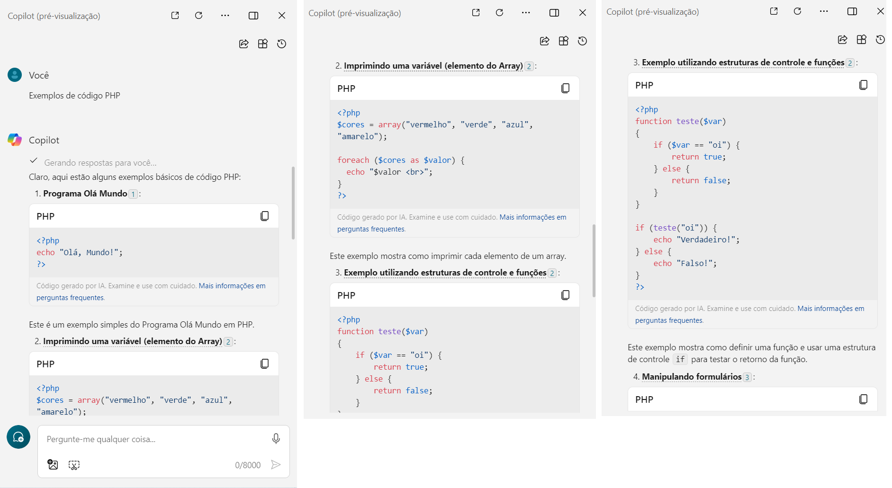
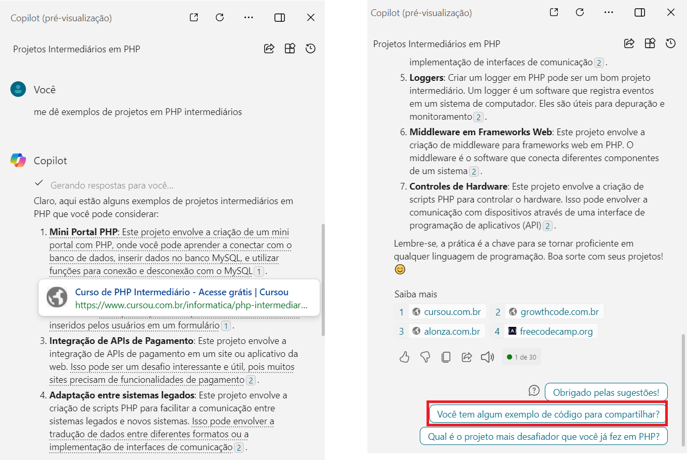
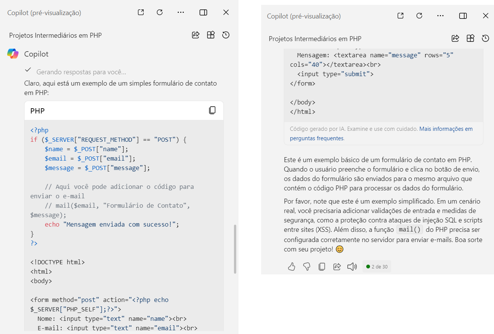

# MS_Azure_AI900_DIO__IA_Generativa_com_Copilot
 _Projeto realizado para a Certificação IA900 oferecida pela Microsoft em parceria com a DIO - Digital Innovation One_

---
## O Copilot

O _Copilot_ é o assistente de inteligência artificial criado pela Microsoft, que se baseia no modelo GPT-4 da OpenAI para realizar diversas funções a partir de prompts — os comandos de texto usados para controlar a IA.

O _Copilot_  é uma IA generativa, ou seja, ele tem a capacidade não apenas gerar uma buscar como os SEO's (Search Engine Optimization) fazem, mas também de gerar novos conteúdos, como textos, imagens e até músicas. Ele realiza isso com base em padrões aprendidos de dados existentes. Ele é alimentado com exemplos e, em seguida, usa redes neurais para criar novas saídas que se assemelham ao que foi visto nos dados de treinamento.

---
## Interagindo com o Copilot
---
A versão do _Copilot_ que utilizo é o aplicativo para desktop no Windows 10. Ele fica no canto inferior da tela, de fácil acesso, auxiliando e aumentando a produtividade, quando preciso dele para resolver alguma tarefa. Vamos aos exemplos:

### Solicitando uma receita de Torta

Em uma tarefa fácil, solicitei uma receita de torta de sardinha e o copilot, interagindo comigo como se fosse um humano, fez a busca e informou duas receitas, além das fontes das pesquisas.

### Solicitando um exemplo de código

No segundo exemplo, solicitei alguns exemplos de código em PHP, para saber como fazer alguns códigos iniciais e aprender mais da linguagem.O _Copilot_ retornou com excelentes exemplos, desde o básico 'Hello World' até um exemplo com a estrutura de controle 'if-else.

### Solicitando ideias de projetos

Por fim, solicitei ao _Copilot_ alguns exemplos de projetos intermediários na linguagem PHP.Ele realizou uma pesquisa bem parecida com os tradicionais SEO'S. 

Mas ao clicar na sugestão abaixo 'Você tem algum exemplo de código para compartilhar?' é onde o _Copilot_ mostra seu grande potencial e total diferença nas pesquisas.Ele
retornou com um exemplo de código praticamente pronto, para um dos projetos citados na pesquisa anteior e informa que é um exemplo simplificado, onde ainda faltam completar algumas partes do código. Mas, para um programador em "apuros" ou para alguém que está aprendendo uma nova linguagem de programação, o _Copilot_ é uma excelente ferramenta, que não substitui o homem, pelo contrário, se torna um aliado na busca por soluções inovadoras.

---
## Links:
---
- **O que é o Copilot e como funciona a IA da Microsoft** Disponível em: https://canaltech.com.br/inteligencia-artificial/o-que-e-copilot-como-funciona-a-ia-da-microsoft/, Acesso em: 30 de Abril de 2024.
- **Microsoft Copilot** Disponível em: https://www.microsoft.com/pt-br/microsoft-copilot, Acesso em: 30 de Abril de 2024.